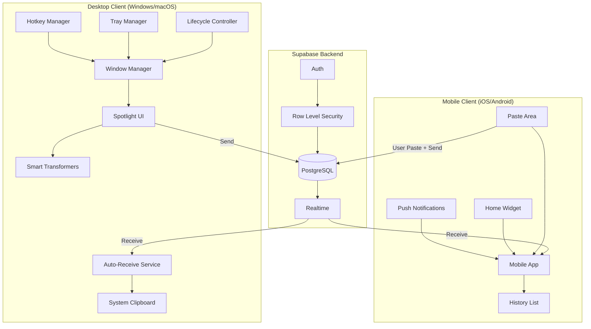

# GhostCopy Design Document

## Overview

GhostCopy is a Flutter-based cross-platform clipboard synchronization application. The desktop version (Windows/macOS) operates as an invisible background utility with a "Spotlight-style" popup interface, while mobile versions (iOS/Android) serve as receivers with push notifications and home screen widgets.

The architecture follows a client-server model where Supabase provides the backend infrastructure (PostgreSQL database, Realtime subscriptions, and authentication). All clients connect to the same Supabase instance, enabling real-time synchronization without custom server code.

## Architecture



### Bidirectional Sync Flow

The synchronization is bidirectional with platform-appropriate UX:

1. **Desktop → Mobile**: User triggers hotkey, sends via Spotlight UI, mobile receives push notification and auto-copies
2. **Mobile → Desktop**: User pastes into mobile app's send field, taps Send, desktop auto-receives and copies to system clipboard
3. **Desktop Auto-Receive**: When items arrive from any device, desktop automatically copies to system clipboard (no manual action needed)

Note: Due to iOS/Android clipboard restrictions, mobile cannot auto-detect clipboard changes. Users must explicitly paste content into the app to send.

## Components and Interfaces

### 1. Window Manager Service

Manages the invisible window lifecycle and Spotlight popup behavior.

```dart
abstract class IWindowService {
  Future<void> initialize();
  Future<void> showSpotlight();
  Future<void> hideSpotlight();
  Future<void> centerWindow();
  Future<void> focusWindow();
  bool get isVisible;
}
```

### 2. Hotkey Service

Handles global keyboard shortcut registration and events.

```dart
abstract class IHotkeyService {
  Future<void> registerHotkey(HotKey hotkey, VoidCallback callback);
  Future<void> unregisterHotkey(HotKey hotkey);
  void dispose();
}
```

### 3. Tray Service

Manages system tray icon and context menu.

```dart
abstract class ITrayService {
  Future<void> initialize();
  Future<void> setIcon(String iconPath);
  Future<void> setContextMenu(List<TrayMenuItem> items);
  void dispose();
}

class TrayMenuItem {
  final String label;
  final VoidCallback? onTap;
  final bool isSeparator;
}
```

### 4. Clipboard Repository

Handles all Supabase database operations for clipboard items.

```dart
abstract class IClipboardRepository {
  Future<void> insert(ClipboardItem item);
  Stream<List<ClipboardItem>> watchHistory({int limit = 50});
  Future<List<ClipboardItem>> getHistory({int limit = 50});
  Future<void> delete(String id);
}
```

### 5. Lifecycle Controller

Manages Sleep Mode transitions and resource optimization.

```dart
abstract class ILifecycleController {
  bool get isSleeping;
  void enterSleepMode();
  void exitSleepMode();
  void addPausable(Pausable pausable);
  void removePausable(Pausable pausable);
}

abstract class Pausable {
  void pause();
  void resume();
}
```

### 6. Smart Transformer Service

Detects and transforms clipboard content based on format.

```dart
abstract class ITransformerService {
  ContentType detectType(String content);
  String prettifyJson(String json);
  JwtPayload? decodeJwt(String token);
  Color? parseHexColor(String text);
}

enum ContentType { plainText, json, jwt, hexColor }

class JwtPayload {
  final Map<String, dynamic> claims;
  final DateTime? expiration;
  final String? userId;
}
```

### 7. Game Mode Service

Manages notification suppression during full-screen applications.

```dart
abstract class IGameModeService {
  bool get isActive;
  void toggle();
  void queueNotification(ClipboardItem item);
  List<ClipboardItem> flushQueue();
}
```

### 8. Auto-Receive Service (Desktop)

Handles automatic clipboard population when items are received from other devices.

```dart
abstract class IAutoReceiveService {
  Future<void> initialize();
  Future<void> onItemReceived(ClipboardItem item);
  void setEnabled(bool enabled);
  bool get isEnabled;
}
```

### 9. Mobile Send Service

Handles user-initiated clipboard sending from mobile (paste-to-send flow due to OS clipboard restrictions).

```dart
abstract class IMobileSendService {
  Future<void> sendContent(String content);
  Future<String?> readClipboard(); // Only works when app is in foreground
}
```

## Data Models

### ClipboardItem

```dart
class ClipboardItem {
  final String id;
  final String userId;
  final String content;
  final String? deviceName;
  final String deviceType; // 'windows', 'macos', 'android', 'ios'
  final bool isPublic;
  final DateTime createdAt;
  
  Map<String, dynamic> toJson();
  factory ClipboardItem.fromJson(Map<String, dynamic> json);
}
```

### AppState

```dart
class AppState {
  final bool isSleeping;
  final bool isGameModeActive;
  final bool isSpotlightVisible;
  final List<ClipboardItem> history;
  final ClipboardItem? currentItem;
  final ContentType? detectedContentType;
}
```

## Database Schema

```sql
CREATE TABLE clipboard (
  id bigint PRIMARY KEY GENERATED BY DEFAULT AS IDENTITY,
  user_id uuid REFERENCES auth.users NOT NULL,
  content text NOT NULL,
  device_name text,
  device_type text NOT NULL,
  is_public boolean DEFAULT false,
  created_at timestamptz DEFAULT timezone('utc'::text, now())
);

-- Row Level Security
ALTER TABLE clipboard ENABLE ROW LEVEL SECURITY;

CREATE POLICY "Users can view own items" ON clipboard
  FOR SELECT USING (auth.uid() = user_id);

CREATE POLICY "Users can insert own items" ON clipboard
  FOR INSERT WITH CHECK (auth.uid() = user_id);

CREATE POLICY "Users can delete own items" ON clipboard
  FOR DELETE USING (auth.uid() = user_id);

-- Index for efficient history queries
CREATE INDEX idx_clipboard_user_created ON clipboard(user_id, created_at DESC);
```

## UI Design System

### Design Language
Inspired by Discord and Blip - modern, sleek, dark-themed with glassmorphism effects.

### Color Palette
```dart
class GhostColors {
  // Background layers
  static const background = Color(0xFF0D0D0F);      // Deep black
  static const surface = Color(0xFF1A1A1D);         // Card surfaces
  static const surfaceLight = Color(0xFF2A2A2D);    // Elevated surfaces
  
  // Accent colors
  static const primary = Color(0xFF5865F2);         // Discord-like purple-blue
  static const primaryHover = Color(0xFF4752C4);
  static const success = Color(0xFF3BA55C);         // Green for confirmations
  
  // Text
  static const textPrimary = Color(0xFFFFFFFF);
  static const textSecondary = Color(0xFFB9BBBE);
  static const textMuted = Color(0xFF72767D);
  
  // Glassmorphism
  static const glassBackground = Color(0x1AFFFFFF); // 10% white
  static const glassBorder = Color(0x33FFFFFF);     // 20% white
}
```

### Typography
```dart
class GhostTypography {
  static const fontFamily = 'Inter'; // or 'SF Pro Display' on macOS
  
  static const headline = TextStyle(fontSize: 18, fontWeight: FontWeight.w600);
  static const body = TextStyle(fontSize: 14, fontWeight: FontWeight.w400);
  static const caption = TextStyle(fontSize: 12, fontWeight: FontWeight.w400);
  static const mono = TextStyle(fontFamily: 'JetBrains Mono', fontSize: 13);
}
```

### Spotlight Window Design
- Size: 500px wide, auto-height (max 400px)
- Border radius: 12px
- Background: Glassmorphism with blur effect
- Shadow: Subtle drop shadow for depth
- Animation: Fade in + scale from 0.95 to 1.0 (150ms ease-out)

### Micro-interactions
- Button hover: Scale 1.02 + brightness increase
- Input focus: Subtle glow ring
- Toast notifications: Slide in from bottom-right
- History items: Staggered fade-in on load


## Correctness Properties

*A property is a characteristic or behavior that should hold true across all valid executions of a system-essentially, a formal statement about what the system should do. Properties serve as the bridge between human-readable specifications and machine-verifiable correctness guarantees.*

### Property 1: Clipboard Content Population
*For any* system clipboard content, when the Spotlight Window appears, the text field SHALL contain that exact clipboard content.
**Validates: Requirements 1.2**

### Property 2: Sleep Mode Resource Pausing
*For any* app state where the Spotlight Window is hidden, all animation TickerProviders and non-essential stream subscriptions SHALL be in a paused state.
**Validates: Requirements 3.1, 3.2**

### Property 3: Sleep Mode Round-Trip
*For any* app state, hiding then showing the Spotlight Window SHALL restore all animations and streams to their pre-hidden state.
**Validates: Requirements 3.3**

### Property 4: Hotkey Listener Invariant
*For any* app state (sleeping or awake), the global hotkey listener SHALL remain active and responsive.
**Validates: Requirements 3.4**

### Property 5: History Limit Enforcement
*For any* clipboard history query, the returned list SHALL contain at most 50 items.
**Validates: Requirements 4.1**

### Property 6: History Sort Order
*For any* list of clipboard items returned from history, items SHALL be sorted by creation date in descending order (newest first).
**Validates: Requirements 4.2**

### Property 7: Realtime History Update
*For any* new clipboard item received via Realtime subscription, the local history list SHALL contain that item without manual refresh.
**Validates: Requirements 5.2**

### Property 8: Device Metadata Completeness
*For any* clipboard item sent to Supabase, the item SHALL include non-null device_name and device_type fields.
**Validates: Requirements 5.3**

### Property 9: User ID Association
*For any* clipboard item stored in the database, the item SHALL have a user_id matching the authenticated user.
**Validates: Requirements 5.4**

### Property 10: Game Mode Notification Queuing
*For any* incoming clipboard notification while Game Mode is active, the notification SHALL be added to the queue without displaying visual alerts.
**Validates: Requirements 6.1**

### Property 11: Game Mode Send Invariant
*For any* send operation while Game Mode is active, the clipboard item SHALL be successfully sent to Supabase.
**Validates: Requirements 6.2**

### Property 12: Game Mode Queue Flush
*For any* set of notifications queued during Game Mode, deactivating Game Mode SHALL result in all queued notifications being displayed.
**Validates: Requirements 6.3**

### Property 13: JSON Detection
*For any* string that is valid JSON, the content type detector SHALL return ContentType.json.
**Validates: Requirements 7.1**

### Property 14: JWT Detection and Decoding
*For any* valid JWT token string, the transformer SHALL successfully decode and return the payload claims.
**Validates: Requirements 7.2**

### Property 15: Hex Color Detection
*For any* string containing a valid hex color code (e.g., #FF0000), the transformer SHALL detect and parse the color value.
**Validates: Requirements 7.3**

### Property 16: JSON Round-Trip
*For any* valid JSON object, prettifying then parsing SHALL produce a data structure equivalent to the original.
**Validates: Requirements 7.5, 7.6**

### Property 17: User Data Isolation
*For any* authenticated user querying clipboard history, the returned items SHALL contain only items where user_id matches the authenticated user's ID.
**Validates: Requirements 9.2, 9.3**

### Property 18: Mobile Send with Device Type
*For any* content sent from mobile via the paste-to-send flow, the clipboard item SHALL include device_type as "android" or "ios".
**Validates: Requirements 8.7**

### Property 19: Desktop Auto-Receive
*For any* clipboard item received via Realtime from another device, the desktop system clipboard SHALL contain that item's content.
**Validates: Requirements 11.1**

### Property 20: Auto-Receive Deduplication
*For any* sequence of clipboard items received in quick succession, only the most recent item SHALL be copied to the system clipboard.
**Validates: Requirements 11.4**

## Error Handling

### Network Errors
- **Supabase Connection Failure**: Display a subtle offline indicator in the tray icon. Queue outgoing items locally and retry with exponential backoff.
- **Realtime Subscription Drop**: Automatically reconnect with backoff. Fetch missed items on reconnection.

### Authentication Errors
- **Token Expiration**: Silently refresh the token. If refresh fails, prompt user to re-authenticate.
- **Invalid Credentials**: Display error in the Spotlight Window and prevent sync operations.

### Clipboard Access Errors
- **Permission Denied**: On macOS, prompt for Accessibility permissions. On Windows, log error and notify user.
- **Empty Clipboard**: Allow sending empty content but display a warning.

### Smart Transformer Errors
- **Invalid JSON**: Gracefully fall back to plain text mode. Do not show Prettify button.
- **Malformed JWT**: Display "Invalid Token" message instead of decoded payload.
- **Invalid Hex Color**: Ignore and treat as plain text.

## Testing Strategy

### Testing Framework
- **Unit Tests**: `flutter_test` (built-in)
- **Property-Based Tests**: `glados` package for Dart property-based testing

### Unit Testing Approach
Unit tests will cover:
- Specific examples demonstrating correct behavior
- Edge cases (empty strings, null values, boundary conditions)
- Integration points between services
- Error handling paths

### Property-Based Testing Approach
Property tests will verify universal properties across generated inputs:
- Each property test will run a minimum of 100 iterations
- Tests will be tagged with the format: `**Feature: ghostcopy, Property {number}: {property_text}**`
- Smart generators will constrain inputs to valid domains (e.g., valid JSON strings, valid JWT tokens)

### Test Categories

1. **Smart Transformer Tests**
   - JSON detection and prettification round-trip
   - JWT token detection and decoding
   - Hex color detection and parsing

2. **Lifecycle Controller Tests**
   - Sleep mode transitions
   - Resource pausing/resuming
   - Hotkey listener persistence

3. **Clipboard Repository Tests**
   - Insert operations with metadata
   - History query limits and sorting
   - User isolation (RLS simulation)

4. **Game Mode Tests**
   - Notification queuing
   - Queue flushing on deactivation
   - Send operations during active mode

### Test File Structure
```
test/
├── unit/
│   ├── services/
│   │   ├── transformer_service_test.dart
│   │   ├── lifecycle_controller_test.dart
│   │   └── game_mode_service_test.dart
│   └── repositories/
│       └── clipboard_repository_test.dart
└── property/
    ├── transformer_properties_test.dart
    ├── lifecycle_properties_test.dart
    ├── history_properties_test.dart
    └── game_mode_properties_test.dart
```
